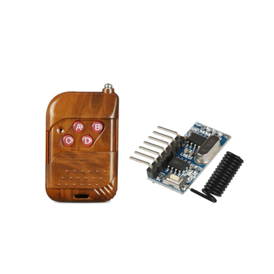
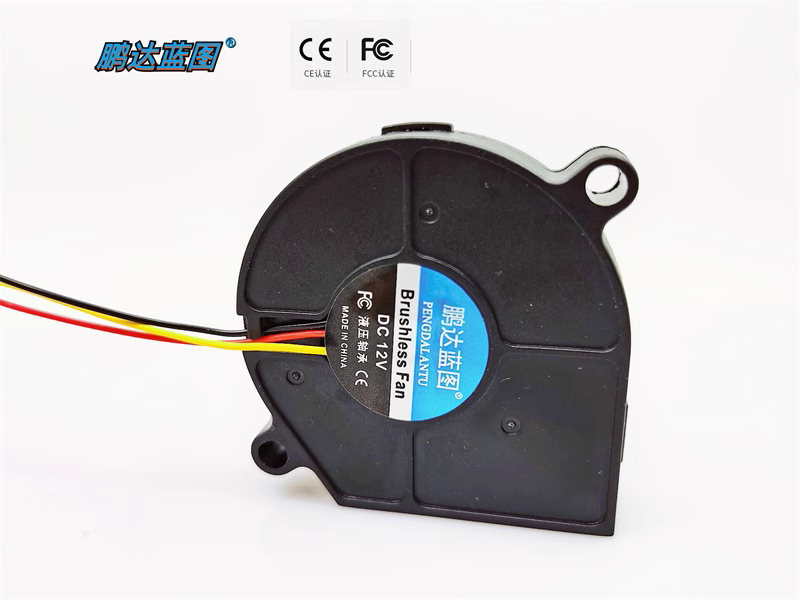
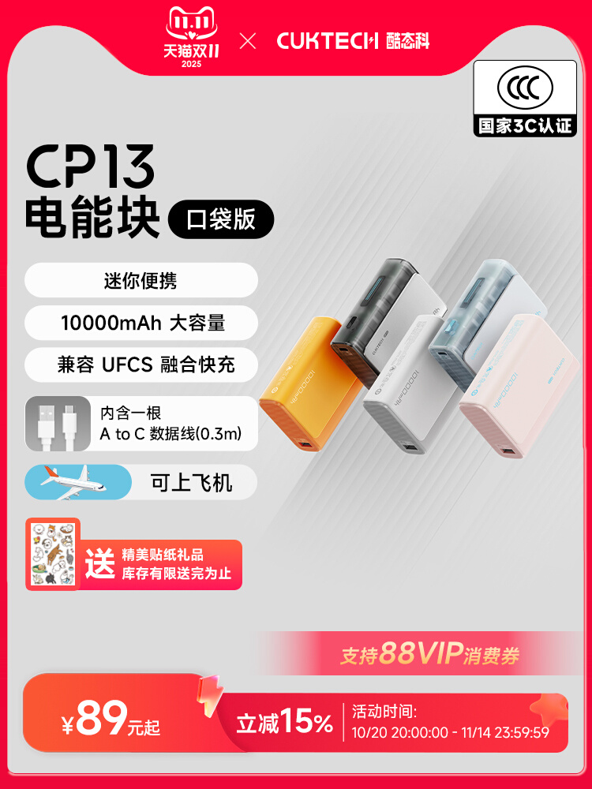
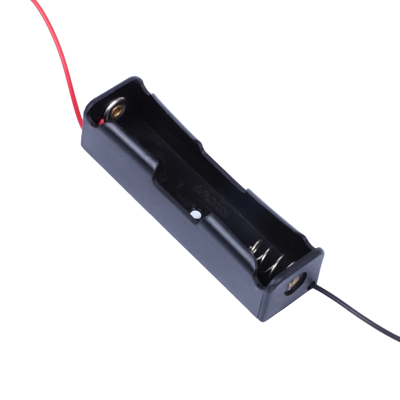
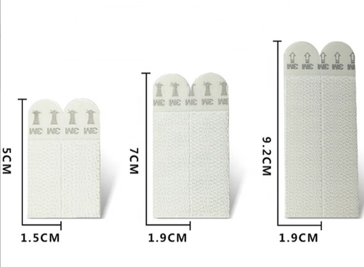

# BOM（物料清单）范例

> 所有价格均默认不含邮费
>
> 图片与链接仅供参考，不代表推荐该店家
>
> ~~卖家收邮费？多买几个或者换一家~~
 
### 范例1

|名称|商品名|数量|备注|参考价格（单个/元）|参考图片|参考链接|
|:-:|-|:-:|-|:-:|:-:|-|
|风扇|台达 5010 5CM 5V 0.40A 鼓风机离心双滚珠风扇 BFB0505HHA-C|2~4|请注意型号应当完全一致，否则可能买到风力更小的版本 *这个尺寸里最猛的风扇！*|15||[链接](https://item.taobao.com/item.htm?id=627440463380)|
|连接线|SM对插线2/3/4P连接线对接线电子线2.54MM公母对插一套公母线插头|5~10|由于风扇提供的是公头，可以适当多买一点母头线 ~~和某辉没有关系~~|0.5||[链接](https://detail.tmall.com/item.htm?id=12390358377)|
|电池|国产七里顶 18650充电锂电池 3400mah|1~2|注意该电池不带保护板，需要配合带保护板的电池盒使用|12||[链接](https://item.taobao.com/item.htm?id=600570720658)|
|电池盒|免焊接18650电池盒电池仓并联3.7V|1|带锂电池保护板，不要买成串联的，记得同时买DC线|5.5||[链接](https://item.taobao.com/item.htm?id=607050611787)|
|控制器|遥控开关5V 433MHz 无线智能继电器模块带遥控|1|注意最大工作电压为5V|7.7||[链接](https://item.taobao.com/item.htm?id=15223199112)|
|固定材料|3M魔术贴丙烯酸背胶蘑菇扣黑色250级|10|买250级，不要买400级的 推荐直接按长度购买，自行裁剪|18.8||[链接](https://item.taobao.com/item.htm?id=521048541758)|

> 按照2风扇2电池计算，上述方案共需18.8+7.7+5.5+24+5+30=91元
 
### 范例2

|名称|商品名|数量|备注|参考价格（单个/元）|参考图片|参考链接|
|:-:|-|:-:|-|:-:|:-:|-|
|风扇|鹏达蓝图5015液压轴承大口5CM5V涡轮鼓风机风扇|2～4|风力相对较低|5||[链接](https://item.taobao.com/item.htm?id=675332480793)|
|连接线|usb分线器一拖三数据线插头充电U盘扩展器车载多接口一分二转接头|1|买仅充电的就行，无需数据功能|7.8||[链接](https://item.taobao.com/item.htm?id=654564026451)|
|电池|德力普水枪18650锂电池3.7v|1|注意需要店家额外送一根转USB母口的线，或者另外买一根|29.9||[链接](https://detail.tmall.com/item.htm?id=680574941464)|
|电池2|XTAR 18650 3300mAh锂电池强光手电专用 3.6v大容量 带保护板可充|1|另外一种带保护板的电池，不带线，需要配合下面的电池盒一起使用|36||[链接](https://detail.tmall.com/item.htm?id=646611654618)|
|电池盒|18650电池盒|1||1.2||[链接](https://item.taobao.com/item.htm?id=40271994011)|
|控制器|迷你RF单色控制器 5V射频单色灯条控制器 led灯条无线11键USB接口|1||7.2||[链接](https://item.taobao.com/item.htm?id=673910655680)|
|固定材料|3m高曼无痕魔力扣照片相框贴婚纱照装饰画固定免钉不伤墙面免打孔|8～16|注意不要买成没有蘑菇扣的类似商品|14.2/8 25.8/16||[链接](https://item.taobao.com/item.htm?id=645568453674)|

> 按照2风扇1电池计算，上述方案共需14.2+7.2+1.2+29.9+7.8+10=70.3元

### 额外说明

* 注意BOM里面几乎所有的东西都可以替换，以上两个BOM仅供参考：

	* 风扇可以换成同直径风力更小的风扇以降低噪声

	> 如果确实需要自行挑选风扇，请注意风扇额定电压应当为5V，不要购买本方案不支持的12V风扇
	
	> 一般来说，同尺寸下额定电流越大的风扇，其风力也越大

	* 连接线可以全部替换成USB接口，进一步降低改造难度（或替换成其他任意你喜欢的接口~~以提高改造难度~~，如田宫接口、XT30等）

	> 由于整套方案正常工作电流不会超过1.5A，不会因为使用特定的接口出现烧接口等问题

	* 电池和电池盒可以直接取消，使用外置充电宝

	> 注意大多数充电宝在负载较低时会自动断电，会导致风扇全部关闭后无法进行远程遥控，需要重新插拔USB线激活充电宝

	* 控制器可以直接使用非无线控制器，此时需要将控制器布置在靠近头壳外边沿的位置方便开关

	* 固定材料可以（*但不推荐*）全部使用热熔胶，以牺牲可维护性的代价降低成本

	> ***不应该将电池/电池盒永久固定在头壳内部***，电池在不使用时应当拆下保存

* 购买风扇时，一般均可让风扇卖家帮你改成对应的接口，省去自己改线的麻烦

* 电池可根据自身品牌偏好进行挑选，但无需购买支持大电流的电池（常用于强光手电等，容量相对较低）
	
> 如果使用无内置保护板的锂电池，请务必选择带保护板的电池盒以防止电池过放