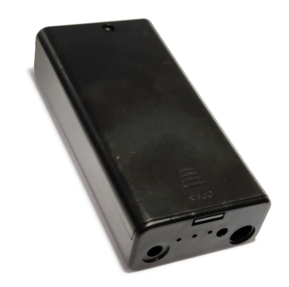
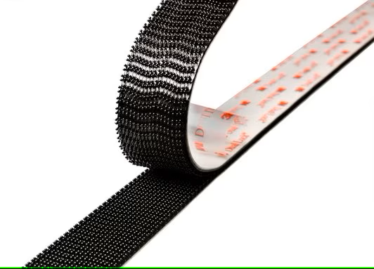

# 购买元器件

## 器件选型

### 电池

电池的选择直接决定了风扇的续航时长，在条件允许的情况下应当尽可能地选择续航更长的方案

但由于头壳尺寸限制和安全性考虑，能装的电池种类和数量存在上限

---

同时应当注意，不同种类的可充电电池需要使用对应种类的充电器进行安全充电

**使用错误的充电器进行充电或者对不可充电电池进行充电会导致严重后果（包括但不限于电池损坏、电池爆炸等）**

---

各种电池的参考续航时长如下表所示

> 以下均假设使用型号为BFB0505HHA，额定功率为1.30W的5V风扇

> 续航单位均为小时

|电池类型|电池数量|电压|额定容量|续航（双风扇）|续航（四风扇）|备注|
|-|:-:|-|-|-|-|-|
|7号电池|4|6V|800mAh|1.28|0.64|四节电池串联|
|5号电池|4|6V|2000mAh|3.20|1.60|四节电池串联|
|18650锂电池|1|3.7V|3400mAh|8.84|4.42||
|18650锂电池|2|3.7V|6800mAh|17.67|8.84|两节电池并联|
|21700锂电池|1|3.7V|5000mAh|12.99|6.50||
|5000mAh充电宝|1|5V|3100mAh|5.96|2.98|充电宝的标称容量不是额定容量|

> 计算公式为\[额定容量\]/(\[风扇数量\]*(\[电池电压\]/(\[风扇额定电压\]/\[风扇额定电流\])))
>> 由于风扇是非纯电阻电路，这种计算方式在非额定电压场景下可能存在较大误差，仅供参考
>>
>> 实际续航一般低于该计算值，建议选择电池时保留一定的续航余量，防止出现电量耗尽的情况

> 注意不同的电压不仅会导致续航出现差距，同时也会影响风扇的转速

以下为不应当选择的电池及原因

|电池类型|不选择的原因|
|-|-|
|7号电池|容量过小，续航极低|
|5号电池|尺寸过大，难以在头壳内安装|
|软包锂电池|在头壳内安装时易弯折，导致电池结构受损产生**严重安全问题**，并且小尺寸软包锂电池容量过小|
|锂亚电池|不是锂电池，不能充电，且输出电流极低，无法持续给风扇供电|
|锂铁电池|不是锂电池，不能充电，本质上是一种7号/5号电池|
|14500锂电池|容量过小，续航极低|
|4680锂电池|~~装不进头壳~~|

### 风扇

风扇的选择需要满足以下几个条件：

* 风压/风量应该尽可能大
* 体积应该尽可能小
* 噪音应该尽可能小
* 额定电压应该和使用的电源相匹配
* 不能使用很容易缠上头发的轴流风扇

显然可以看出，以上几个条件是互相冲突的：风量大的风扇，要么体积大，要么噪音大；小体积大风量风扇又多为12V等更高电压的风扇，和上述电源电压不匹配

实践过程中发现，头壳内安装5cm风扇是一个较为极限的尺寸，更大的风扇一般难以安装在头壳内（设计头壳时安装的风扇除外）

在优先风压/风量的情况下，以下为两款较为推荐的风扇：

[台达BFB0505HHA-CY2C](https://www.delta-fan.com/products/BFB0505HHA-CY2C.html)

> 5V 5cm涡轮风扇中已知性能最强劲的一款，代价是高达5900 RPM的转速带来的噪音
>
> 该风扇系列还有转速较低的BFB0505HA-C（5100 RPM）、BFB0505MA-C（4300 RPM，不推荐）和BFB0505LA-C（3500 RPM，不推荐）可供选择
>
> 该风扇无官方零售渠道，淘宝上卖的该型号风扇一般默认为拆机翻新货

[鹏达蓝图5015Y](https://item.taobao.com/item.htm?id=675332480793)

> 这款风扇在性能和上述风扇基本一致的情况下，用5mm的厚度作为代价换取了相对更低的噪音
>
> 该风扇无官网Datasheet可供参考，链接即为官方零售渠道

如果愿意牺牲一定的性能代价换取较低的噪声，仍然建议风扇最低尺寸不低于4cm

### 控制器（可选）

一般建议戴头的时候保持风扇开启，但由于风扇噪声等因素，有时候可能需要临时关闭部分或所有风扇

如果使用外置充电宝，显然不需要使用控制器控制风扇开关，直接拔线即可

一个最简单的开关方案是使用现成的`USB开关`，此时将USB开关固定在后脑勺底部即可

也可以使用其他体积较小的开关，此时需要自行焊接线路与接口

不建议在使用充电宝供电的情况下使用无线控制器

> 无线控制器需要小电流持续供电，市面上卖的各类充电宝均无法同时兼顾小电流供电保持控制器运转与大电流供电驱动风扇，会导致关闭风扇后无法再次开启风扇

---

最简单的无线控制器方案为各类`LED控制器`，直接使用USB接口，插上即用，并且支持风速调节

> 主要缺点为无法独立控制每个风扇，只能整体控制风扇转速
>
> 另外遥控器偏大

如果有一定的动手能力，可以购买`四路无线遥控套件`并手动焊接线路

### 其他

连接接口一般选择方便插拔维护的USB Type-A接口，购买风扇时一般可以要求卖家将风扇直接改为该USB接口

如果对接口尺寸有一定要求，可以考虑SM接口、小田宫接口、XT30接口等常见接口

由于总电流一般不会超过2A，各种接口间不会有明显的性能区别

---

不考虑维护性的话，可以直接使用热熔胶将上述元器件固定在头壳内

但一般考虑到可维护性，推荐使用3M蘑菇扣固定元器件

扣合3M蘑菇扣时注意需要适当用力确保完全扣合，未完全扣合的两片蘑菇扣可能会松动掉落

~~魔术贴？你不穿皮的吗~~

## BOM（物料清单）范例

以下为基于上述元器件选购思路，总结的一些购买参考范例

> 所有价格均默认不含邮费
>
> 图片与链接仅供参考，不代表推荐该店家
>
> ~~卖家收邮费？多买几个或者换一家~~
 
### 范例1

|名称|商品名|数量|备注|参考价格（单个/元）|参考图片|参考链接|
|:-:|-|:-:|-|:-:|:-:|-|
|风扇|台达 5010 5CM 5V 0.40A 鼓风机离心双滚珠风扇 BFB0505HHA-C|2~4|请注意型号应当完全一致，否则可能买到风力更小的版本 *这个尺寸里最猛的风扇！*|15||[链接](https://item.taobao.com/item.htm?id=627440463380)|
|连接线|SM对插线2/3/4P连接线对接线电子线2.54MM公母对插一套公母线插头|5~10|由于风扇提供的是公头，可以适当多买一点母头线 ~~和某辉没有关系~~|0.5||[链接](https://detail.tmall.com/item.htm?id=12390358377)|
|电池|国产七里顶 18650充电锂电池 3400mah|1~2|注意该电池不带保护板，需要配合带保护板的电池盒使用|12||[链接](https://item.taobao.com/item.htm?id=600570720658)|
|电池盒|免焊接18650电池盒电池仓并联3.7V|1|带锂电池保护板，不要买成串联的，记得同时买DC线|5.5||[链接](https://item.taobao.com/item.htm?id=607050611787)|
|控制器|遥控开关5V 433MHz 无线智能继电器模块带遥控|1|注意最大工作电压为5V|7.7||[链接](https://item.taobao.com/item.htm?id=15223199112)|
|固定材料|3M魔术贴丙烯酸背胶蘑菇扣黑色250级|10|买250级，不要买400级的 推荐直接按长度购买，自行裁剪|18.8||[链接](https://item.taobao.com/item.htm?id=521048541758)|

> 按照2风扇2电池计算，上述方案共需18.8+7.7+5.5+24+5+30=91元
 
### 范例2

|名称|商品名|数量|备注|参考价格（单个/元）|参考图片|参考链接|
|:-:|-|:-:|-|:-:|:-:|-|
|风扇|鹏达蓝图5015液压轴承大口5CM5V涡轮鼓风机风扇|2～4|风力相对较低|5||[链接](https://item.taobao.com/item.htm?id=675332480793)|
|连接线|usb分线器一拖三数据线插头充电U盘扩展器车载多接口一分二转接头|1|买仅充电的就行，无需数据功能|7.8||[链接](https://item.taobao.com/item.htm?id=654564026451)|
|电池|德力普水枪18650锂电池3.7v|1|注意需要店家额外送一根转USB母口的线，或者另外买一根|29.9||[链接](https://detail.tmall.com/item.htm?id=680574941464)|
|电池2|XTAR 18650 3300mAh锂电池强光手电专用 3.6v大容量 带保护板可充|1|另外一种带保护板的电池，不带线，需要配合下面的电池盒一起使用|36||[链接](https://detail.tmall.com/item.htm?id=646611654618)|
|电池盒|18650电池盒|1||1.2||[链接](https://item.taobao.com/item.htm?id=40271994011)|
|控制器|迷你RF单色控制器 5V射频单色灯条控制器 led灯条无线11键USB接口|1||7.2||[链接](https://item.taobao.com/item.htm?id=673910655680)|
|固定材料|3m高曼无痕魔力扣照片相框贴婚纱照装饰画固定免钉不伤墙面免打孔|8～16|注意不要买成没有蘑菇扣的类似商品|14.2/8 25.8/16||[链接](https://item.taobao.com/item.htm?id=645568453674)|

> 按照2风扇1电池计算，上述方案共需14.2+7.2+1.2+29.9+7.8+10=70.3元

### 额外说明

* 注意BOM里面几乎所有的东西都可以替换，以上两个BOM仅供参考：

	* 风扇可以换成同直径风力更小的风扇以降低噪声

	> 如果确实需要自行挑选风扇，请注意风扇额定电压应当为5V，不要购买本方案不支持的12V风扇
	
	> 一般来说，同尺寸下额定电流越大的风扇，其风力也越大

	* 连接线可以全部替换成USB接口，进一步降低改造难度（或替换成其他任意你喜欢的接口~~以提高改造难度~~，如田宫接口、XT30等）

	> 由于整套方案正常工作电流不会超过1.5A，不会因为使用特定的接口出现烧接口等问题

	* 电池和电池盒可以直接取消，使用外置充电宝

	> 注意大多数充电宝在负载较低时会自动断电，会导致风扇全部关闭后无法进行远程遥控，需要重新插拔USB线激活充电宝

	* 控制器可以直接使用非无线控制器，此时需要将控制器布置在靠近头壳外边沿的位置方便开关

	* 固定材料可以（*但不推荐*）全部使用热熔胶，以牺牲可维护性的代价降低成本

	> ***不应该将电池/电池盒永久固定在头壳内部***，电池在不使用时应当拆下保存

* 购买风扇时，一般均可让风扇卖家帮你改成对应的接口，省去自己改线的麻烦

* 电池可根据自身品牌偏好进行挑选，但无需购买支持大电流的电池（常用于强光手电等，容量相对较低）
	
> 如果使用无内置保护板的锂电池，请务必选择带保护板的电池盒以防止电池过放