# 安装步骤

1. 将购买的风扇、控制器和电池**在头壳外**按照以下电路图进行连接，并进行测试
	
> 如果风扇不转，请检查电路连接是否正常（电路断开），电池是否出现异常发热（电路出现短路）

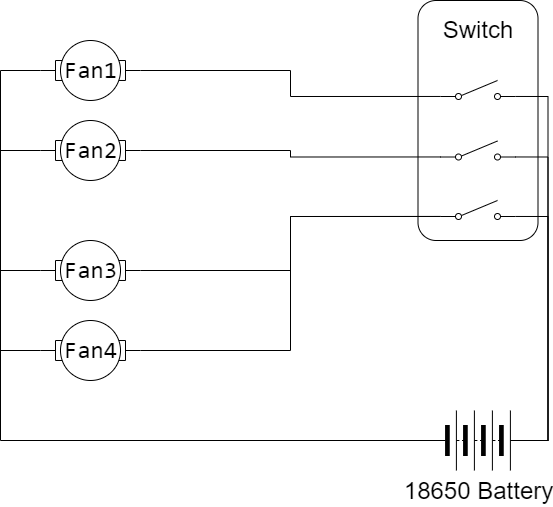

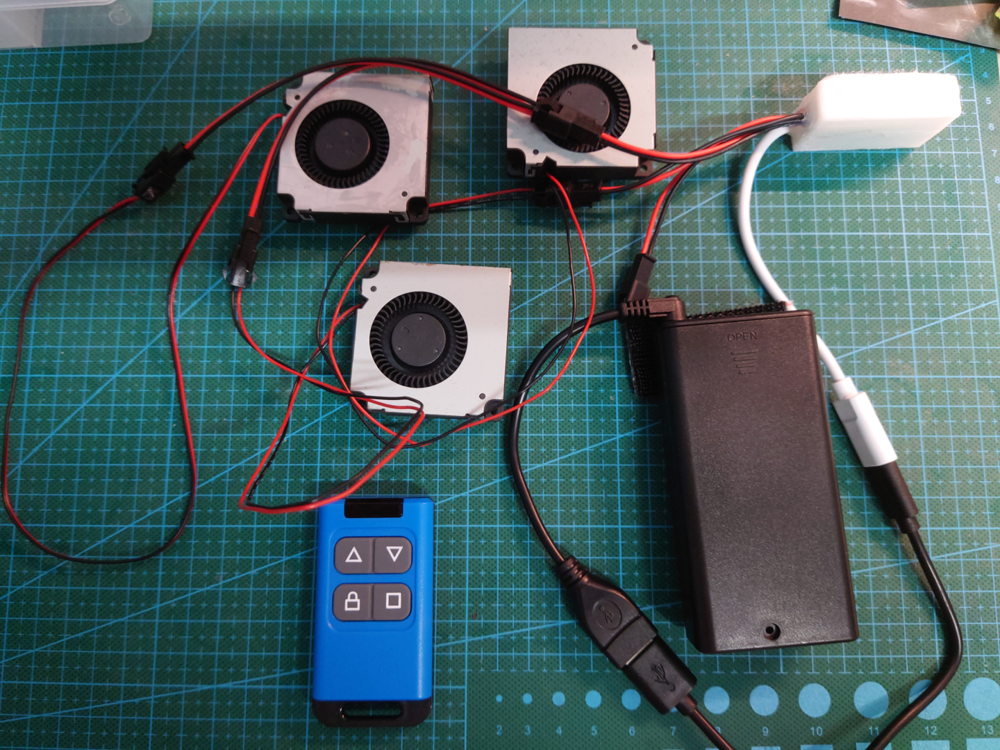

> 实物连接图相比电路图省略了一个风扇（Fan2）

2. 将风扇1和风扇2背部按照如图所示贴上一条蘑菇扣，并将另外一条蘑菇扣（**不撕保护膜**）**十字交叉**按在这条蘑菇扣上
  
> 图中风扇出风口方向朝下，*进风口被切割板堵住了*
> 
> 注意蘑菇扣的粘贴方向和风扇出风口的关系：
> 
> 第一条蘑菇扣与出风口平行
> 
> 第二条蘑菇扣与出风口（和第一条蘑菇扣）垂直

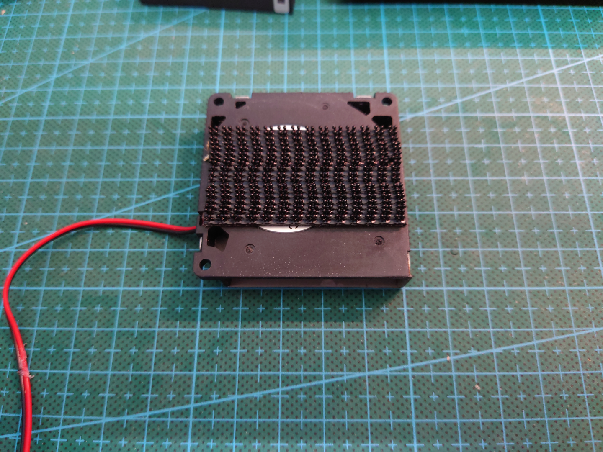

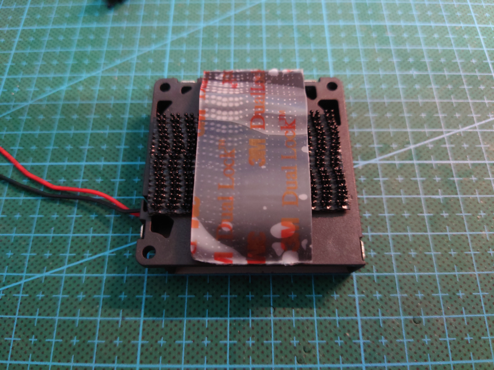

3. 将风扇1贴近头壳如图所示的位置，确认可以贴在此处后撕下蘑菇扣保护膜，并贴在头壳上
	
> 注意风扇进/出风口方向需要与图示方向一致（出风口方向朝下，指向眼片与鼻子）

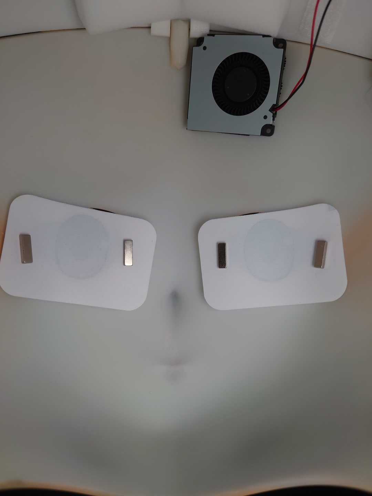

4. （可选）将风扇2按照步骤3中的方式，贴在头壳另一侧
	
> 注意风扇进/出风口方向需要与图示方向一致（出风口方向朝下，指向眼片与鼻子）

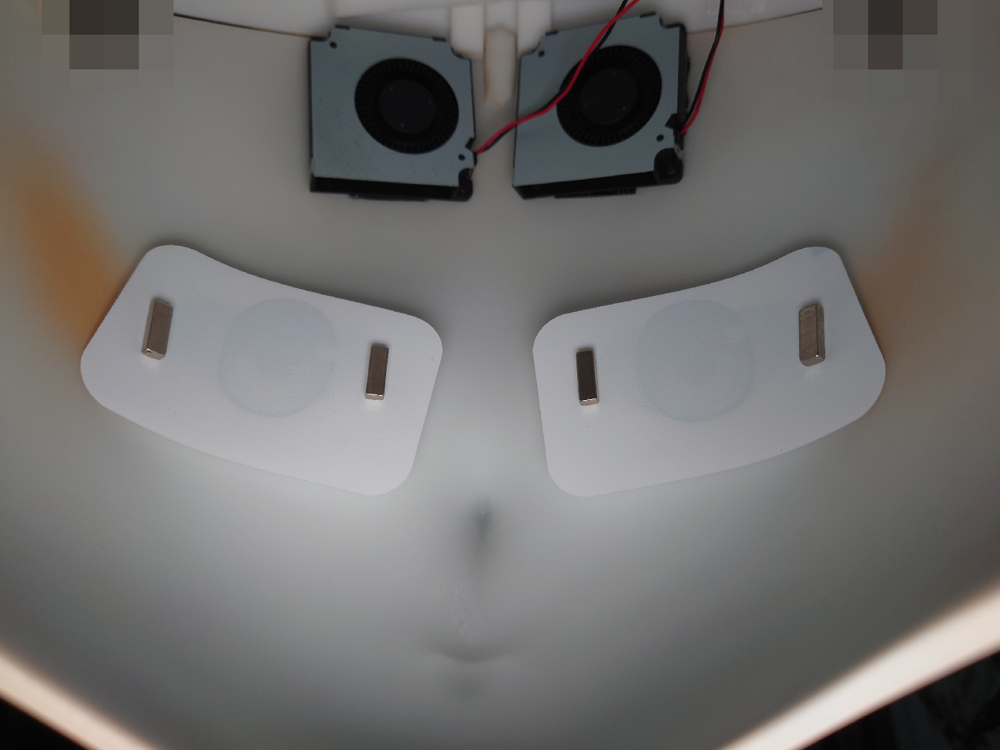

5. 将电池盒背部按照如图所示贴上蘑菇扣，并将另外两条蘑菇扣（**不撕保护膜**）**十字交叉**按在这条蘑菇扣上

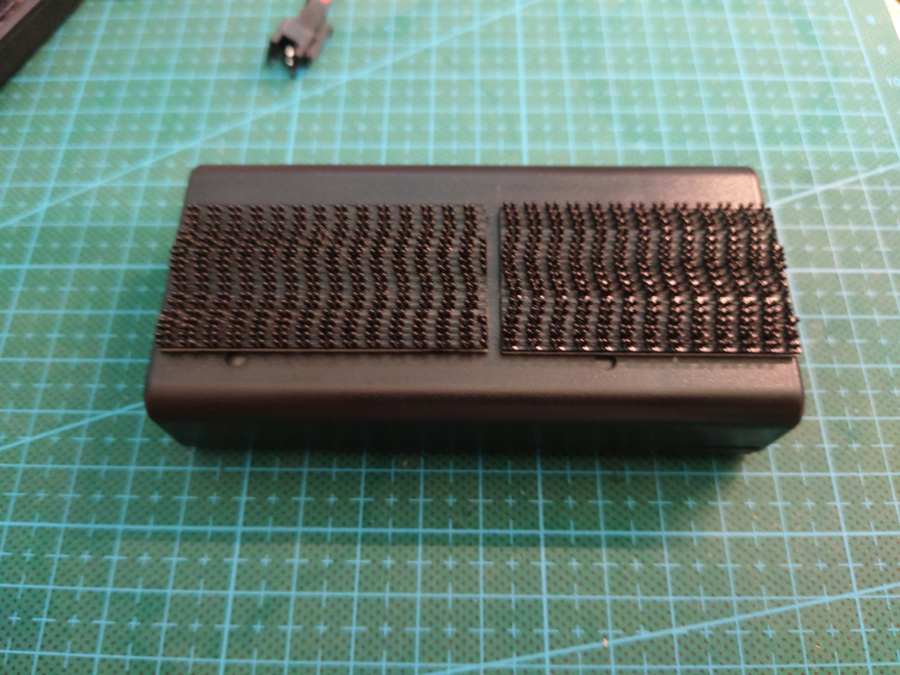

6. 将电池盒贴近头壳如图所示的位置，确认可以贴在此处后撕下蘑菇扣保护膜，并贴在头壳上
	
>这一步如果感觉蘑菇扣贴不上去，可适当移动电池盒和蘑菇扣，或移除部分挡住电池盒位置的海绵
>
> 如图所示，为了寻找合适的位置安装电池盒，电池盒安装位置并不在头壳中心

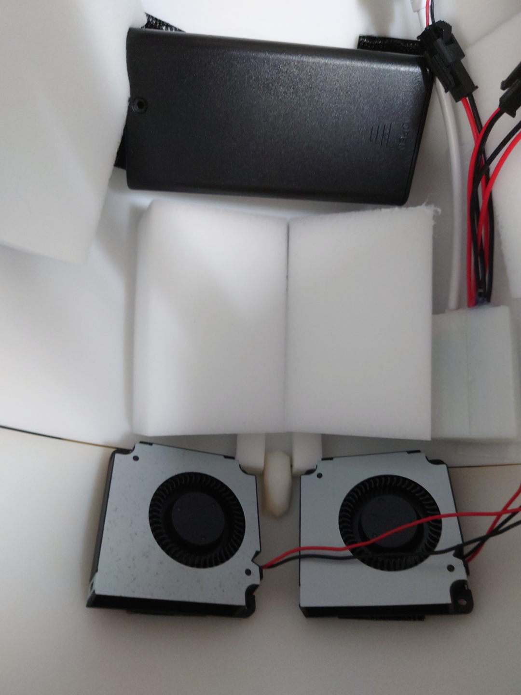

7. 将控制器背部贴上蘑菇扣，贴近头壳如图所示位置，确认可以贴在此处后撕下蘑菇扣保护膜，并贴在头壳上
	
> 控制器的可选位置较多，请自行寻找更适合自己的位置
> 
> 图中为了便于指示控制器的位置，在固定好的控制器上方放了另外一个控制器

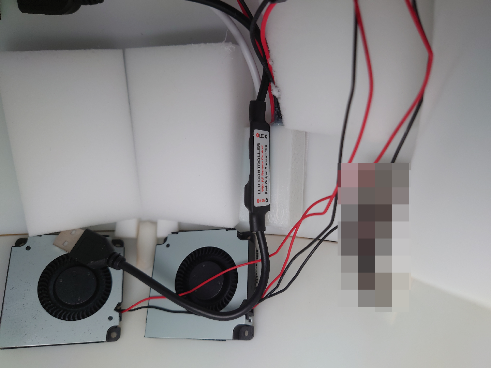

8. （可选）将风扇3与风扇4安装在如图所示的位置，出风口一左一右

> 即使头壳内无类似的导风结构，将风扇安装在此处仍然能够起到一定的效果
> 
> 注意如果头壳后盖部分已经镂空，则应该将进风口面朝外（如图所示），否则进风口方向应该与前置风扇1/2一致（朝内）

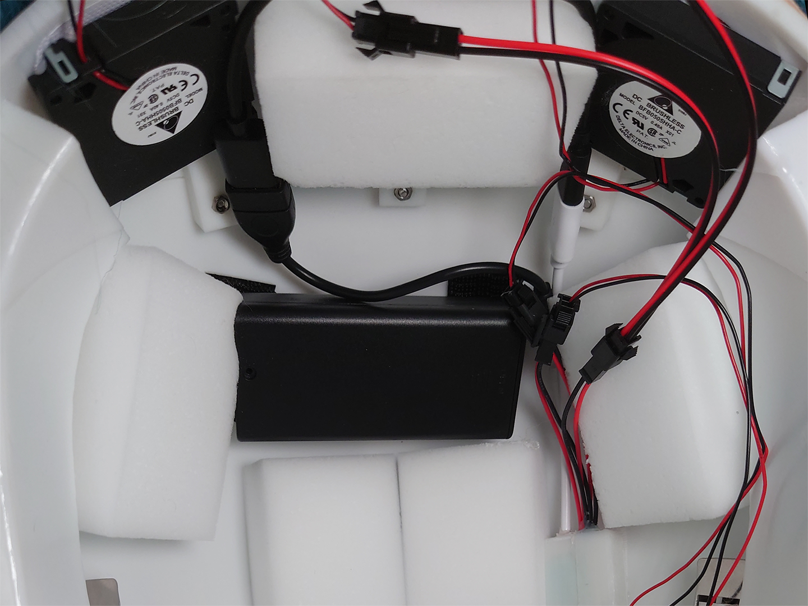

9. 再次进行测试，确认所有风扇均可正常运作，电池无异常发热问题

10. 保持风扇运转，戴上头，检查电池盒是否影响到了头壳佩戴舒适性，并体验风扇散热效果

> 上述步骤中提供的位置一般不会影响到头壳佩戴，如果确有影响，需将电池盒移到不影响头壳佩戴的其他位置
> 
> 风扇体积和重量较小，一般难以影响头壳佩戴

11. 摘下头，取出电池盒与电池

> 注意**不佩戴头壳时应当及时取出电池盒与电池**，防止电池长期存储出现老化等问题

12. （可选）使用遮盖胶带固定电线，使头壳内部更加整洁

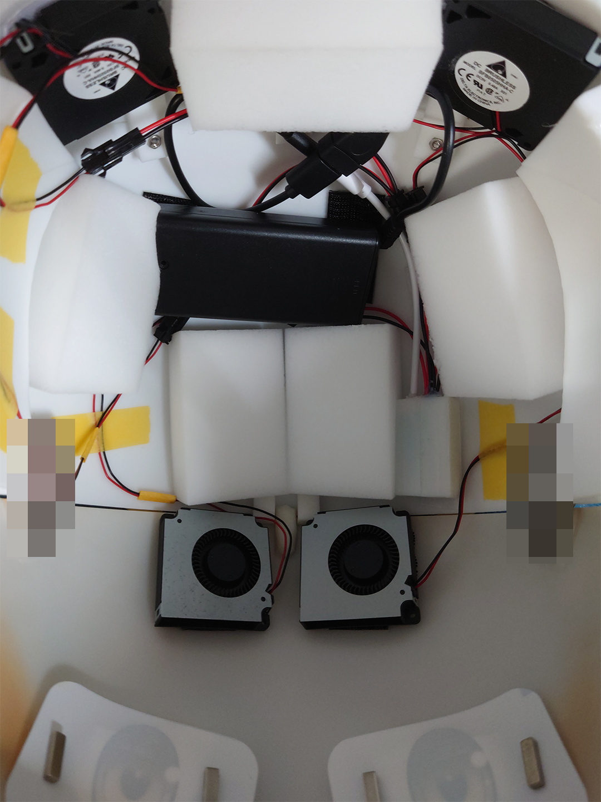